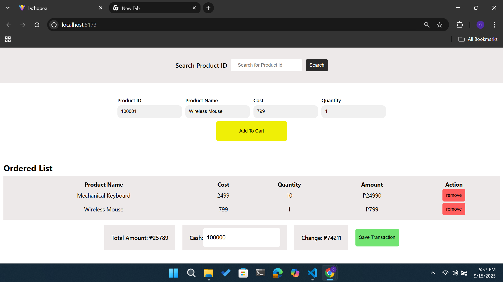
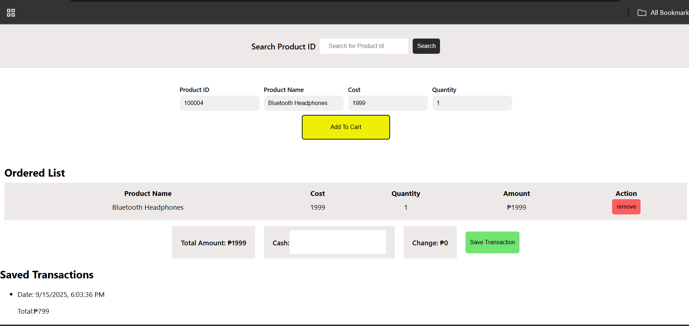

# React Tech Interview Project

<!-- Internal note: This section shows static screenshots for functionality checking -->

> **Preview:** Below is the current UI of the shopping cart.  
> *(These screenshots are for functionality verification; the final design will be responsive and more polished.)*

>**Steps**
> 1. Search for product ID 
     here's the json sample
     export const products = [
  { productId: 100001, name: "Wireless Mouse",        cost: 799  },
  { productId: 100002, name: "Mechanical Keyboard",   cost: 2499 },
  { productId: 100003, name: "LED Desk Lamp",         cost: 999  },
  { productId: 100004, name: "Bluetooth Headphones",  cost: 1999 },
  { productId: 100005, name: "Smartphone Stand",      cost: 399  },
  { productId: 100006, name: "USB-C Charger",         cost: 899  },
  { productId: 100007, name: "Notebook Planner",      cost: 299  },
  { productId: 100008, name: "Backpack",              cost: 1299 },
  { productId: 100009, name: "Reusable Water Bottle", cost: 499  },
  { productId: 100010, name: "Portable SSD 1TB",      cost: 5499 },
];

> 2. Add a Quantity of item
> 3. Click the "Add To Cart" button
> 4. Add your cash in the cash input. take note the cash must greater than the total amount to show the change.
> 5. Click the "Save Transaction" button. And you can see also the saved transaction the you made.

> *This screenshot demonstrates the total amount and change section after checkout.*
